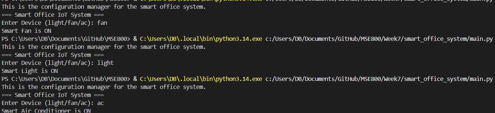

## == Smart Office IoT System ==

# Introduction
whats going in this system:

- The following office wants a smart IoT system
- Devices can be controlled dynamically
- Factory pattern creates devices 
- Singleton manages confirguration

# Design Patter used

# Factory Pattern 
- Used to create devices dynamically based on the user input

# Singleton Pattern
- Ensures that only one configuration dynamically based on our input

# OOP Concepts used
- Inheritance
- Abstraction
- Polymorphism 
- Encapsulation

# Screenshot Prototype (Sample Output)

# Description - The following shows on how the system run which includes (Light, fan, ac)
# these all show that system is working well and that all the lights are on. 
